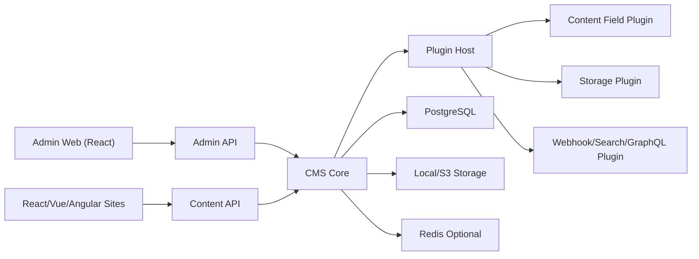

# linkqin-cms 项目开发文档

> 面向对象：后续参与开发的 AI agent、人类开发者、代码审查者。
> 当前阶段：方向确认和开发蓝图。
> 项目定位：轻量级、插件化、API-first 的 Node.js Headless CMS，用于管理展示类网站内容，供 React、Vue、Angular、移动端、小程序或静态站点通过接口消费。

## 1. 背景和目标

`linkqin-cms` 不是传统一体化建站系统，而是内容管理后台加内容 API 服务。它只负责内容建模、内容录入、媒体管理、权限控制、发布流程、接口交付和插件扩展，不绑定任何前端渲染框架。

目标用户：

- 企业官网、品牌站、产品展示站、活动页、文档站、新闻资讯站的运营人员。
- 需要给 React、Vue、Angular 等前端项目提供统一内容 API 的开发团队。
- 需要二次开发和插件扩展的中小型项目团队。

核心目标：

- 轻量级：默认依赖少，启动快，部署简单，单体优先，后续可拆。
- 易管理：后台 UI 清晰，内容类型、栏目、页面、媒体、权限可视化配置。
- 支持二开：代码结构稳定，模块边界清楚，业务逻辑可替换。
- 支持插件：插件可以扩展后台菜单、API 路由、内容字段、钩子、权限、发布动作。
- API-first：所有前端通过接口取内容，不要求前端使用特定框架。
- AI agent 友好：目录、规范、任务拆分、测试策略、接口契约必须明确。

非目标：

- 不做前端页面渲染器，不内置 React/Vue/Angular 页面搭建运行时。
- 不做低代码业务系统平台，第一阶段只服务展示类内容管理。
- 不追求和 Strapi/Payload/Directus 的功能全量对齐。
- 不把插件系统设计成能执行任意不可信代码的开放市场，第一阶段插件默认视为受信代码。

## 2. 在线资料调研结论

调研对象和可借鉴点：

- Strapi：Headless CMS 通过内容类型自动生成 REST API，内容可通过 REST 和 GraphQL 暴露；Content-type Builder 支持 Collection Type、Single Type、Component。参考：
  - https://docs.strapi.io/cms/api/rest
  - https://docs.strapi.io/cms/api/content-api
  - https://docs.strapi.io/cms/features/content-type-builder
  - https://docs.strapi.io/cms/plugins/documentation
- Payload CMS：通过 Collection 和 Global 配置自动生成 REST API，提供 Local API、访问控制和插件化能力。参考：
  - https://payloadcms.com/docs/rest-api/overview
  - https://payloadcms.com/docs/local-api/overview
  - https://payloadcms.com/docs/access-control/overview
- Directus：基于数据库结构动态生成 REST/GraphQL API，并以权限规则控制数据访问。参考：
  - https://directus.com/docs/api
  - https://directus.com/docs/api/permissions
- NestJS：模块、控制器、Provider、Guard、Interceptor 适合组织可维护的 Node.js 后端；NestJS 支持 Fastify 适配器。参考：
  - https://docs.nestjs.com/controllers
  - https://docs.nestjs.com/techniques/performance
- Fastify：插件生态、路由 schema、性能和 JSON 序列化能力适合作为 HTTP 层。参考：
  - https://fastify.io/docs/latest/Reference/Routes/
- Drizzle ORM：轻量、TypeScript 友好、SQL 接近原生、迁移工具明确。参考：
  - https://orm.drizzle.team/docs/overview
  - https://orm.drizzle.team/docs/migrations
- Zod：TypeScript-first 的运行时校验，可作为动态内容字段、插件配置和 API 入参校验基础。参考：
  - https://zod.dev/
  - https://zod.dev/json-schema
- CASL：JavaScript 权限库，适合 RBAC 加字段/记录级权限的增量实现。参考：
  - https://casl.js.org/
- OpenAPI：REST API 机器可读描述标准，适合生成 API 文档、SDK、测试。参考：
  - https://swagger.io/specification/

结论：

- 项目应采用 Headless CMS 思路，先提供稳定 REST API，GraphQL 作为后续可选插件。
- 内容建模必须支持 Collection、Single、Component 三类概念。
- 插件系统必须是核心能力，不是后期补丁。
- 采用 TypeScript 全栈，减少 AI agent 和人类二开时的隐式约定。
- 后端推荐 `NestJS + Fastify Adapter + Drizzle ORM + PostgreSQL`。
- 后台推荐 `React + Vite + Ant Design Pro Components`，因为后台生态成熟，表单、表格、权限菜单实现成本低。

## 3. 最终技术栈

### 3.1 运行时和工程

- Node.js：LTS 版本，建议 Node.js 22 LTS 或更高。
- 包管理：pnpm。
- 语言：TypeScript。
- Monorepo：pnpm workspace。
- 构建：tsup 或 unbuild 用于 packages，Vite 用于 admin。
- 代码质量：ESLint、Prettier、TypeScript strict mode。
- 测试：Vitest、Supertest、Playwright。

### 3.2 后端

- Framework：NestJS。
- HTTP Adapter：Fastify。
- ORM：Drizzle ORM。
- Database：PostgreSQL 为第一优先级。
- Cache/Queue：Redis 可选，用于缓存、发布任务、Webhook 重试。
- Validation：Zod。
- Auth：JWT access token + refresh token；后台会话可使用 httpOnly cookie。
- Authorization：RBAC 起步，预留 CASL 能力模型做字段级和记录级权限。
- API Docs：OpenAPI 3.1。
- File Storage：本地存储起步，S3/MinIO 作为存储插件。

### 3.3 后台管理端

- Framework：React + Vite。
- UI：Ant Design + Ant Design Pro Components。
- State/Data：TanStack Query。
- Router：React Router。
- Form：Ant Design Form，复杂动态字段可结合 JSON Schema/Zod schema。
- Rich Text：TipTap 或 Lexical，第一阶段优先 TipTap。
- Upload：后台统一走资产 API。

### 3.4 前端消费接口

面向 React、Vue、Angular 的展示站统一消费以下接口：

- REST Content API：默认稳定接口。
- Preview API：草稿预览、带 token 的内容预览。
- Asset API：图片、文件、缩略图、元数据。
- Navigation API：栏目、菜单、站点导航。
- Search API：第一阶段可用数据库全文检索，后续插件接 Meilisearch/Elasticsearch。
- Webhook：内容发布后通知前端重新构建或刷新缓存。

GraphQL 不进入 MVP，作为官方插件 `@linkqin/plugin-graphql` 后续实现。

## 4. 总体架构



核心分层：

- `apps/api`：后端服务入口，组合核心模块和插件。
- `apps/admin`：后台管理端。
- `packages/core`：CMS 核心领域模型、插件接口、内容引擎。
- `packages/db`：Drizzle schema、migration、数据库访问。
- `packages/shared`：通用类型、错误码、Zod schema、API DTO。
- `packages/plugin-sdk`：插件开发 SDK。
- `plugins/*`：官方插件。

## 5. 推荐目录结构

```text
linkqin-cms/
  apps/
    api/
      src/
        main.ts
        app.module.ts
        config/
        modules/
          auth/
          users/
          roles/
          content-types/
          entries/
          assets/
          publishing/
          webhooks/
          plugins/
          audit-logs/
        common/
          filters/
          guards/
          interceptors/
          decorators/
      test/
    admin/
      src/
        main.tsx
        app/
        routes/
        layouts/
        pages/
          dashboard/
          content-types/
          entries/
          assets/
          settings/
          plugins/
        components/
        api/
        hooks/
        stores/
        plugin-runtime/
  packages/
    core/
      src/
        content/
        fields/
        permissions/
        publishing/
        plugin-host/
        events/
    db/
      src/
        schema/
        migrations/
        seed/
    shared/
      src/
        dto/
        schemas/
        errors/
        constants/
    plugin-sdk/
      src/
        backend/
        admin/
        types/
  plugins/
    local-storage/
    s3-storage/
    markdown-field/
    seo/
    webhook/
    graphql/
  docs/
    PROJECT_DEVELOPMENT_GUIDE.md
    ADR/
    API/
```

## 6. 核心领域模型

### 6.1 内容类型 Content Type

内容类型定义内容结构，不直接代表某条内容。

字段建议：

- `id`
- `uid`：全局唯一，例如 `article`、`homepage`、`product`
- `kind`：`collection | single | component`
- `displayName`
- `description`
- `fields`：JSONB，字段定义数组
- `options`：JSONB，如是否启用草稿、版本、排序、国际化
- `createdAt`
- `updatedAt`

规则：

- `collection`：多条记录，例如文章、产品、案例。
- `single`：单条记录，例如首页配置、站点配置。
- `component`：可复用结构，例如 SEO、按钮、图片组、FAQ 项。
- 内容类型变更必须产生 schema version。
- 内容类型删除前必须检测是否有 entries 引用。

### 6.2 字段 Field

第一阶段内置字段：

- `text`：短文本。
- `textarea`：长文本。
- `richText`：富文本。
- `number`：数字。
- `boolean`：布尔。
- `date`：日期时间。
- `select`：单选。
- `multiSelect`：多选。
- `media`：媒体引用。
- `relation`：内容关系。
- `component`：单个组件。
- `componentList`：组件列表。
- `json`：JSON 高级字段。
- `slug`：URL 友好标识。

字段定义示例：

```json
{
  "name": "title",
  "type": "text",
  "label": "标题",
  "required": true,
  "localized": false,
  "unique": false,
  "settings": {
    "maxLength": 120
  }
}
```

字段规则：

- `name` 使用 camelCase。
- `type` 必须存在于字段注册表。
- 插件可注册新字段类型。
- 字段必须能转换为后台表单配置、API DTO 校验、内容输出 schema。

### 6.3 内容 Entry

内容记录使用通用表承载，避免每个内容类型都建物理表，降低轻量部署和动态建模成本。

字段建议：

- `id`
- `contentTypeId`
- `status`：`draft | published | archived`
- `locale`：默认 `zh-CN`
- `slug`
- `titleSnapshot`
- `data`：JSONB，真实内容。
- `publishedData`：JSONB，已发布快照。
- `version`
- `createdBy`
- `updatedBy`
- `publishedBy`
- `createdAt`
- `updatedAt`
- `publishedAt`

查询优化：

- `contentTypeId + status + locale`
- `contentTypeId + slug + status + locale`
- `data` JSONB GIN index 视情况启用。
- 常用字段可在 `entry_indexes` 表中做冗余索引，后续插件实现。

### 6.4 媒体 Asset

字段建议：

- `id`
- `storage`
- `bucket`
- `path`
- `filename`
- `mimeType`
- `size`
- `width`
- `height`
- `alt`
- `caption`
- `metadata`
- `createdBy`
- `createdAt`

第一阶段只做上传、列表、删除、元数据编辑。图片裁剪、转码、CDN 签名后续插件处理。

## 7. API 设计

### 7.1 API 分组

- `/api/admin/*`：后台管理接口，需要登录和权限。
- `/api/content/*`：公开或受控内容消费接口。
- `/api/auth/*`：登录、刷新 token、退出。
- `/api/assets/*`：文件访问和上传。
- `/api/webhooks/*`：外部回调和触发。
- `/api/plugins/*`：插件声明的接口。

### 7.2 通用响应格式

成功：

```json
{
  "data": {},
  "meta": {
    "requestId": "req_xxx"
  }
}
```

分页：

```json
{
  "data": [],
  "meta": {
    "page": 1,
    "pageSize": 20,
    "total": 100,
    "pageCount": 5,
    "requestId": "req_xxx"
  }
}
```

失败：

```json
{
  "error": {
    "code": "CONTENT_TYPE_NOT_FOUND",
    "message": "Content type not found",
    "details": {}
  },
  "meta": {
    "requestId": "req_xxx"
  }
}
```

### 7.3 内容消费 API

建议接口：

- `GET /api/content/:contentType`
- `GET /api/content/:contentType/:idOrSlug`
- `GET /api/content/single/:contentType`
- `GET /api/content/navigation/:uid`
- `GET /api/content/search`

查询参数：

- `locale`
- `page`
- `pageSize`
- `sort`
- `fields`
- `populate`
- `filter`
- `status`：公开接口默认只能取 `published`。

示例：

```http
GET /api/content/articles?page=1&pageSize=10&sort=-publishedAt&fields=title,slug,cover,publishedAt
```

### 7.4 后台管理 API

内容类型：

- `GET /api/admin/content-types`
- `POST /api/admin/content-types`
- `GET /api/admin/content-types/:id`
- `PATCH /api/admin/content-types/:id`
- `DELETE /api/admin/content-types/:id`

内容：

- `GET /api/admin/entries?contentType=article`
- `POST /api/admin/entries`
- `GET /api/admin/entries/:id`
- `PATCH /api/admin/entries/:id`
- `DELETE /api/admin/entries/:id`
- `POST /api/admin/entries/:id/publish`
- `POST /api/admin/entries/:id/unpublish`
- `GET /api/admin/entries/:id/versions`

插件：

- `GET /api/admin/plugins`
- `POST /api/admin/plugins/:name/enable`
- `POST /api/admin/plugins/:name/disable`
- `GET /api/admin/plugins/:name/config`
- `PATCH /api/admin/plugins/:name/config`

## 8. 插件系统设计

### 8.1 插件目标

插件可以扩展：

- 后端模块：路由、服务、事件监听、定时任务。
- 字段类型：后台表单、校验规则、序列化逻辑。
- 存储驱动：本地、S3、OSS、COS。
- 后台菜单和页面。
- 权限点。
- Webhook 和发布动作。
- API 输出转换。

### 8.2 插件包结构

```text
plugins/example-plugin/
  package.json
  src/
    index.ts
    backend.ts
    admin.tsx
    fields/
    migrations/
```

### 8.3 插件元信息

```ts
export default definePlugin({
  name: "example-plugin",
  version: "0.1.0",
  displayName: "Example Plugin",
  requires: {
    cms: ">=0.1.0"
  },
  backend: async (ctx) => {
    ctx.routes.register(...)
    ctx.events.on("entry.published", ...)
  },
  admin: async (ctx) => {
    ctx.menu.add(...)
    ctx.fields.register(...)
  }
})
```

### 8.4 插件生命周期

- `register`：注册字段、路由、菜单、权限声明。
- `boot`：应用配置加载后执行。
- `migrate`：执行插件数据库迁移。
- `enable`：启用插件。
- `disable`：禁用插件。
- `dispose`：应用关闭前释放资源。

### 8.5 插件约束

- 插件不得直接修改核心表结构，必须通过 migration API。
- 插件不得绕过权限服务读取后台数据。
- 插件配置必须有 Zod schema。
- 插件对外 API 必须生成 OpenAPI 片段。
- 插件事件处理必须幂等，尤其是 webhook、搜索索引、发布任务。

## 9. 权限模型

第一阶段使用 RBAC：

- User：用户。
- Role：角色。
- Permission：权限点。
- Policy：可选条件规则。

基础角色：

- `super_admin`：全部权限。
- `admin`：后台管理，不能改系统级配置。
- `editor`：内容编辑。
- `viewer`：只读。

权限命名：

```text
content-type:read
content-type:create
content-type:update
content-type:delete
entry:read
entry:create
entry:update
entry:delete
entry:publish
asset:read
asset:upload
asset:delete
plugin:read
plugin:manage
system:settings
```

后续扩展：

- 字段级权限：隐藏或只读某些字段。
- 记录级权限：用户只能管理自己创建的内容。
- API token 权限：用于前端、CI、静态构建系统。

## 10. 发布和预览

内容状态：

- `draft`：草稿，后台可见。
- `published`：已发布，公开 API 可见。
- `archived`：归档，默认不可见。

发布策略：

- 编辑内容只改 `data`。
- 发布时把 `data` 拷贝到 `publishedData`，并记录 `publishedAt`、`publishedBy`。
- 公开 API 默认读取 `publishedData`。
- 预览 API 可读取 `data`，但必须使用 preview token。

Webhook：

- `entry.created`
- `entry.updated`
- `entry.published`
- `entry.unpublished`
- `asset.created`
- `contentType.updated`

Webhook 必须支持：

- 签名。
- 重试。
- 失败日志。
- 手动重放。

## 11. 多语言和多站点策略

MVP：

- 内置 `locale` 字段。
- 默认 `zh-CN`。
- 内容类型可配置是否启用国际化。

后续：

- 多站点 `siteId`。
- 同一内容不同 locale 的关联。
- 站点级配置、域名、导航、主题变量。

## 12. 后台 UI 功能规划

MVP 页面：

- 登录页。
- Dashboard：内容数量、最近发布、待处理事项。
- 内容类型管理：创建 Collection、Single、Component。
- 内容管理：按内容类型列表、编辑、发布、删除。
- 媒体库：上传、筛选、预览、编辑 alt。
- 用户和角色：用户列表、角色权限配置。
- 插件中心：查看、启用、禁用、配置插件。
- 系统设置：站点基础设置、API token、Webhook。

UI 原则：

- 后台是高频工作工具，界面要紧凑、稳定、可扫描。
- 表格、筛选、批量操作是核心体验。
- 表单必须根据字段 schema 动态渲染。
- 所有危险操作必须二次确认。
- 所有保存、发布、上传必须有明确成功/失败反馈。

## 13. 数据库表草案

核心表：

- `users`
- `roles`
- `permissions`
- `role_permissions`
- `api_tokens`
- `content_types`
- `entries`
- `entry_versions`
- `assets`
- `asset_folders`
- `webhooks`
- `webhook_deliveries`
- `plugins`
- `plugin_settings`
- `audit_logs`
- `system_settings`

关键约束：

- `content_types.uid` 唯一。
- `entries(content_type_id, slug, locale)` 对 published 内容应唯一。
- `assets.path` 唯一。
- 删除内容类型前必须检查 `entries`。
- 删除 asset 前必须检查引用，默认软删除或阻止删除。

## 14. AI Agent 开发规则

所有 AI agent 必须遵守：

1. 先读本文件，再动代码。
2. 不要一次性实现多个大模块。按垂直切片开发，例如“content type CRUD + tests”。
3. 新增 API 必须同步更新 DTO、测试、OpenAPI 注解或文档。
4. 新增核心能力必须写单元测试；跨模块流程写集成测试。
5. 动态内容字段不要用临时字符串拼接校验，必须走字段注册表和 Zod schema。
6. 不要让后台 UI 直接拼后端内部字段，必须通过 `packages/shared` 的类型和 API client。
7. 插件不得 import `apps/api` 或 `apps/admin` 内部代码，只能依赖 `packages/plugin-sdk`。
8. 核心模块不得依赖具体插件。
9. 不要在业务代码里硬编码 `article`、`product` 等示例内容类型。
10. 所有错误使用统一错误码。
11. 所有数据写入接口必须写 audit log。
12. 所有公开 API 必须考虑缓存和权限。

## 15. 开发路线图

### Phase 0：工程初始化

交付：

- pnpm workspace。
- TypeScript strict。
- NestJS API app。
- React Vite admin app。
- shared/core/db/plugin-sdk packages。
- ESLint、Prettier、Vitest。
- Docker Compose：PostgreSQL、Redis 可选。

验收：

- `pnpm install`
- `pnpm lint`
- `pnpm test`
- `pnpm dev`
- API health check 可访问。
- Admin 空壳可访问。

### Phase 1：认证和基础后台

交付：

- 用户、角色、权限表。
- 登录、刷新 token、退出。
- 后台路由保护。
- RBAC Guard。
- 初始 super admin seed。

验收：

- 未登录不能访问后台 API。
- super admin 可访问所有后台页面。
- editor 无法管理插件和系统设置。

### Phase 2：内容类型和字段系统

交付：

- Content Type CRUD。
- 内置字段注册表。
- 字段 Zod 校验。
- 后台动态表单原型。

验收：

- 可创建 `article` Collection。
- 可创建 `homepage` Single。
- 字段非法配置会返回明确错误。

### Phase 3：内容 Entry 管理

交付：

- Entry CRUD。
- 草稿/发布。
- 版本记录。
- 内容列表筛选、排序、分页。

验收：

- 后台可创建文章草稿。
- 发布后公开 API 可读取。
- 修改草稿不影响公开 API 的已发布快照。

### Phase 4：媒体库

交付：

- 本地上传。
- 媒体元数据。
- 图片尺寸读取。
- asset 字段关联。

验收：

- 后台可上传图片。
- 内容可引用图片。
- 公开 API 返回 asset URL 和 alt。

### Phase 5：插件系统 MVP

交付：

- 插件 SDK。
- 插件注册和启停。
- 后端路由扩展。
- 字段插件扩展。
- 后台菜单扩展。
- 官方 `seo` 插件和 `local-storage` 插件。

验收：

- 插件可以注册字段类型。
- 插件可以增加后台菜单。
- 禁用插件后相关能力不可用且不破坏核心启动。

### Phase 6：发布集成

交付：

- Webhook。
- API token。
- Preview token。
- OpenAPI 文档。

验收：

- 发布内容后可触发 webhook。
- Next/Vite/Astro 等前端构建服务可用 token 拉取内容。

## 16. 测试策略

后端：

- Unit：字段校验、权限判断、内容状态流转。
- Integration：Content Type CRUD、Entry 发布、Auth 流程、插件注册。
- Contract：公开 Content API 响应格式。

前端：

- Unit：字段表单组件。
- Component：内容编辑页、媒体选择器。
- E2E：登录、创建内容类型、创建文章、发布、公开 API 读取。

Playwright 用途：

- 验证后台关键流程。
- 验证不同 viewport 下后台布局不重叠。
- 验证插件页面能正确注册到菜单。

建议脚本：

```json
{
  "scripts": {
    "dev": "pnpm -r --parallel dev",
    "lint": "pnpm -r lint",
    "test": "pnpm -r test",
    "test:e2e": "playwright test",
    "db:generate": "drizzle-kit generate",
    "db:migrate": "drizzle-kit migrate"
  }
}
```

## 17. 部署策略

MVP 推荐单体部署：

- 一个 Node.js API 服务。
- 一个静态 Admin 前端，由 API 服务或 Nginx 托管。
- 一个 PostgreSQL。
- 本地磁盘或 S3 兼容存储。
- Redis 可选。

Docker Compose 服务：

- `api`
- `admin` 或由 `api` 托管静态文件。
- `postgres`
- `redis`
- `minio` 可选。

环境变量：

```text
NODE_ENV=development
APP_URL=http://localhost:3000
ADMIN_URL=http://localhost:5173
DATABASE_URL=postgres://...
JWT_ACCESS_SECRET=...
JWT_REFRESH_SECRET=...
STORAGE_DRIVER=local
STORAGE_LOCAL_DIR=./storage
DEFAULT_LOCALE=zh-CN
```

## 18. 安全基线

- 密码使用 Argon2id 或 bcrypt。
- refresh token 存 hash，不存明文。
- 后台 cookie 使用 httpOnly、sameSite。
- 上传文件必须校验 mime、大小、扩展名。
- 公开 API 默认只返回 published 内容。
- 所有后台写操作需要 CSRF 或 Bearer token 策略明确。
- API token 必须可设置过期时间和权限范围。
- Webhook 签名使用 HMAC。
- 审计日志记录 userId、action、resource、before/after 摘要、ip、userAgent。

## 19. 关键设计决策

### 19.1 为什么不直接基于 Strapi/Payload/Directus 二开

这些项目功能成熟，但二开时会继承大量内部约束。`linkqin-cms` 的目标是轻量、可控、AI agent 友好，因此选择自研核心，同时借鉴它们已经验证过的 Headless CMS 模式。

### 19.2 为什么使用通用 entries 表加 JSONB

展示类 CMS 的内容模型经常变化。每次内容类型变化都改物理表会增加 migration 和回滚复杂度。JSONB 能降低动态建模成本。对高频查询字段，可通过冗余索引表或插件优化。

### 19.3 为什么后端用 NestJS 而不是纯 Fastify

纯 Fastify 更轻，但大型 CMS 需要清楚的模块边界、依赖注入、Guard、Interceptor 和测试组织。NestJS 提供结构，Fastify Adapter 提供性能和插件生态，两者组合更适合长期二开。

### 19.4 为什么后台选 React

虽然项目服务的前端可以是 React、Vue、Angular，但 CMS 后台本身需要大量表单、表格和权限菜单。React + Ant Design Pro Components 能更快交付稳定后台。这个选择不影响内容 API 被其他前端框架使用。

## 20. MVP 完成定义

当以下能力全部可用时，认为 MVP 完成：

- 管理员可以登录后台。
- 管理员可以创建内容类型。
- 管理员可以创建、编辑、发布内容。
- 前端可以通过 REST API 获取已发布内容。
- 管理员可以上传媒体并在内容中引用。
- 角色权限可以限制内容管理能力。
- 插件可以注册一个字段类型和一个后台菜单。
- 发布内容可以触发 webhook。
- 项目有基础测试和 OpenAPI 文档。

## 21. 后续可扩展方向

- GraphQL 插件。
- 国际化增强。
- 多站点。
- 工作流审批。
- 定时发布。
- 内容导入导出。
- 图片处理和 CDN。
- 搜索插件。
- 评论/表单插件。
- SDK 生成：JavaScript/TypeScript client。
- 前端框架示例：React、Vue、Angular、Next.js、Nuxt、Astro。

## 22. 给下一个 AI Agent 的第一步任务建议

优先执行 Phase 0：

1. 初始化 pnpm workspace。
2. 创建 `apps/api`、`apps/admin`、`packages/shared`、`packages/core`、`packages/db`、`packages/plugin-sdk`。
3. 配置 TypeScript strict、ESLint、Prettier、Vitest。
4. 创建 NestJS + Fastify health check。
5. 创建 React + Vite 后台空壳。
6. 创建 Docker Compose PostgreSQL。
7. 写 README 的本地启动说明。

不要先做复杂后台页面，也不要先做插件市场。先让最小工程骨架可运行、可测试、可扩展。
